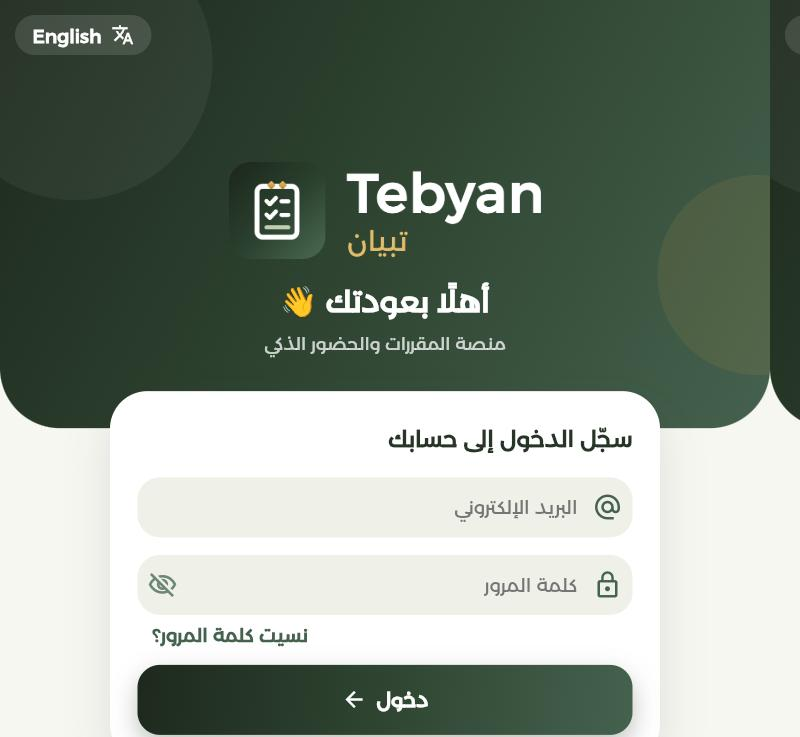
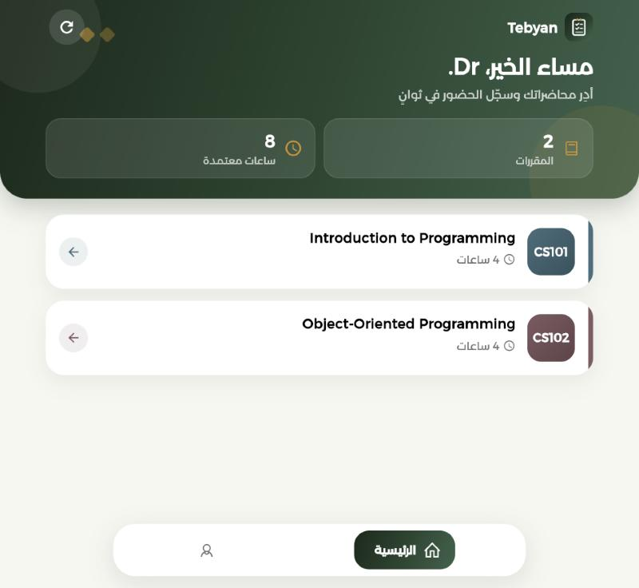
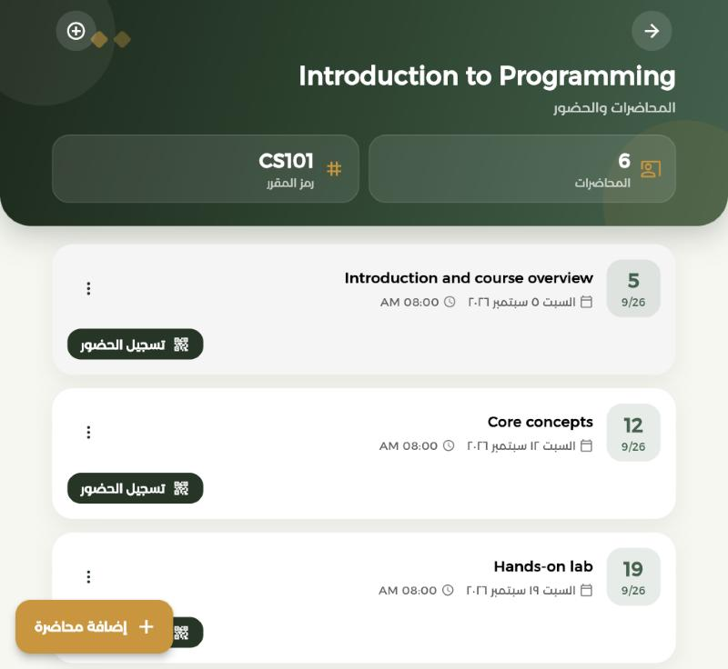
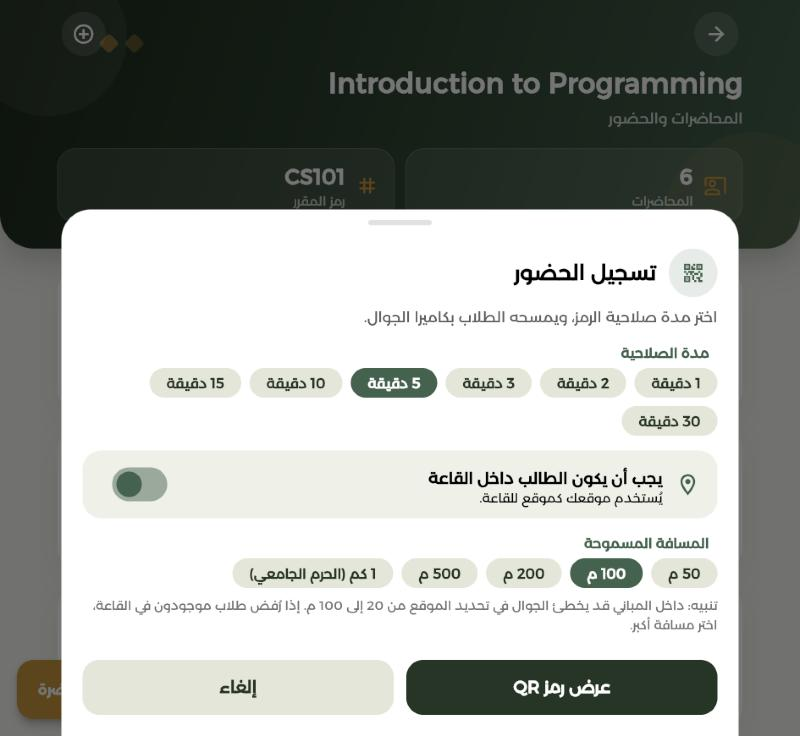
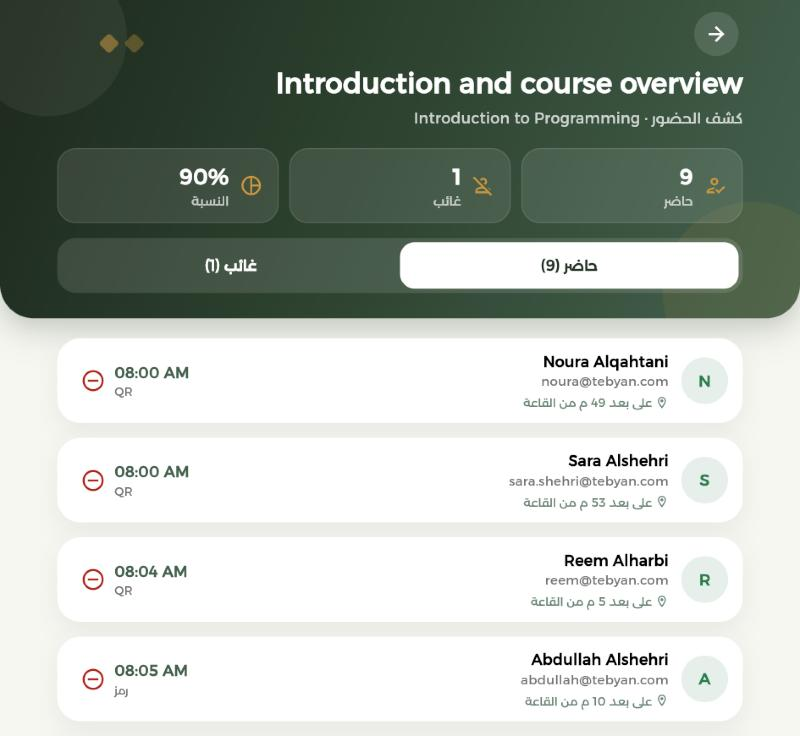

<div align="center">


# Tebyan | تبيان

**A course management and QR-code attendance platform for universities.**

[🌐 Live demo](https://tepyan-9e53b.web.app)


</div>

---

## About the project

Tebyan is a web platform that helps universities manage their **courses**,
**lecturers**, **students** and **lectures**, and take **attendance with QR codes**
instead of paper sheets.

The lecturer shows a QR code on the screen during the lecture, students scan it
with their phone camera, and their attendance is recorded instantly. The
lecturer can then review a full attendance sheet for every lecture.

The platform has three types of accounts:

| Account | What they can do |
|---|---|
| **Admin** | Add and manage courses, lecturers and students, and assign courses to them |
| **Lecturer** | Manage lectures, open attendance with a QR code, and review the attendance sheet |
| **Student** | See their courses and lectures, scan the QR code, and follow their attendance status |

The app works on phones and computers, supports **Arabic (right-to-left)** and
**English**, and can be added to the phone's home screen like a regular app (PWA).

## Screenshots

| Sign in | Lecturer home | Lectures |
|:---:|:---:|:---:|
|  |  |  |

| Attendance settings (expiry time and location check) | Attendance sheet |
|:---:|:---:|
|  |  |

## Background

Tebyan was originally built as a **university team graduation project**.

After graduation, I continued working on it on my own. I improved several
features, added new ones, fixed bugs, gave it a new look, and published it
online as a web app.

## What I improved after graduation

### ✨ New features

**Attendance**
1. **QR code expiry time** – the lecturer chooses how many minutes attendance stays open, with a countdown timer.
2. **Backup code** – an 8-character code students can type if their camera does not work.
3. **Live attendance list** – the lecturer sees students' names appear on the screen as they check in.
4. **Manual attendance** – the lecturer can mark a student present or absent by hand.

**Preventing attendance fraud**

5. **A QR code that changes every 20 seconds** – if a student takes a photo of the code and sends it to someone outside the classroom, it expires before it can be used.
6. **Location check** – the lecturer can require students to be inside the classroom. A student who is too far away cannot check in.
7. **Distance in the attendance sheet** – the sheet shows how far each student was from the classroom when they checked in.
8. **Protection at the database level** – old codes and check-ins from far away are rejected by the database itself, not only by the app.

**General**

9. **Page statistics** – quick numbers shown at the top of every page.
10. **Database security rules** – each user can only reach their own data, and passwords are no longer stored in the database.

### 🔧 Improved
1. **Attendance sheet** for each lecture – present and absent students and the attendance rate.
2. **Student attendance status** for each lecture – present, absent, or attendance open.
3. **Password reset** – the admin can send a password reset link to any user.
4. **Brand and design** – a new logo and a complete redesign of the app.

### 🐞 Fixed
1. Several bugs, including the app getting stuck while loading.
2. Updated old Flutter packages so the project runs on the latest Flutter version.

## Tech stack

| Area | Technology |
|---|---|
| App | Flutter (Dart), GetX for state management and navigation |
| Sign-in | Firebase Authentication (email and password) |
| Database | Cloud Firestore + security rules |
| Hosting | Firebase Hosting |
| QR code | `qr_flutter` to create codes, `mobile_scanner` to scan them |
| Location | `geolocator` |


## Deployment

The app is hosted on **Firebase Hosting**:
👉 **https://tepyan-9e53b.web.app**

To publish a new version:

```bash
# Upload the database security rules
firebase deploy --only firestore:rules

# Build the web app and publish it
flutter build web
firebase deploy --only hosting
```
